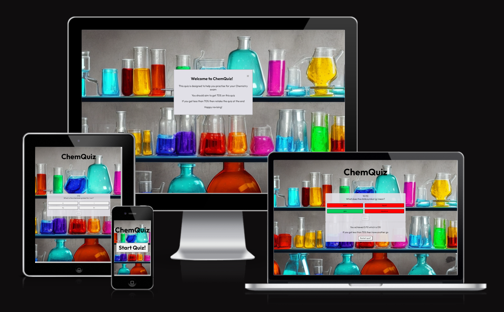
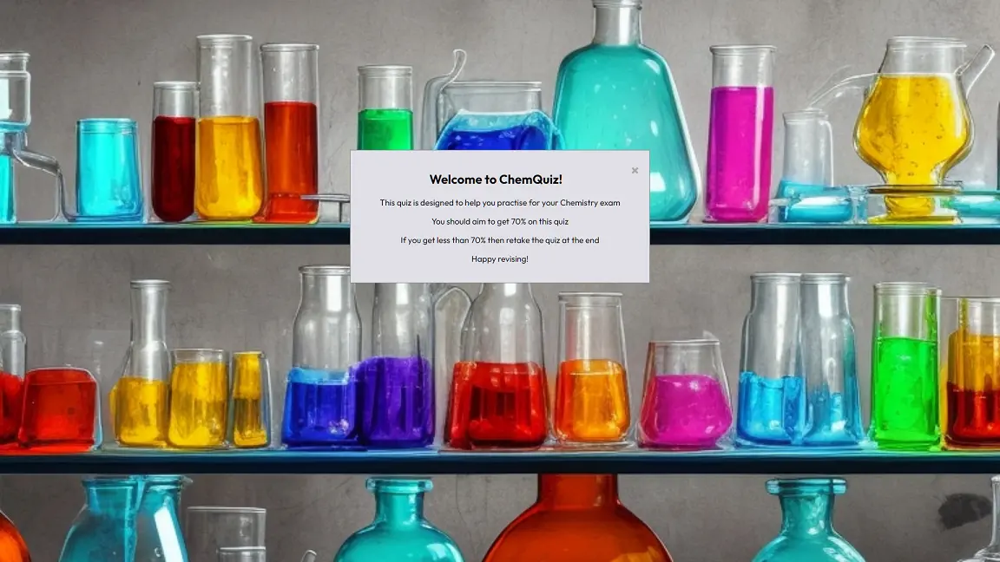

# ChemQuiz

The purpose of ChemQuiz is for GCSE Chemistry students to revise for their exams by completing a short multiple choice quiz. They would be encouraged to repeat the quiz if they received less than 70%. It is designed for Secondary school students in England.

The live site can be accessed via this [link](https://elamont174.github.io/chem-quiz/).
The GitHub repositroy can be accessed [here](https://github.com/elamont174/chem-quiz).

## User Stories
- As a first time user, I would want to test my initial knowledge by completing the quiz.
- As a repeat user, I would want to continue to test my knowledge and improve my score.
- As a repeat user, I would want different questions and/or shuffled questions

## Features
### Opening Modal Screen
- When you first enter the site, a modal button appears with the 'rules' of the quiz. 
- There is an 'x' button to direct users to close the screen but clicking anywhere on the page will cause the screen to close. 
- This screen will not be revisited unless the user revisits/refreshes the page.
- 

### Start button
- After closing the opening screen, the user will see a large button which says "Start Quiz!" 
- Clicking this button will start the quiz.
- 
  
### The questions
- A box appears containing the question, 4 answer buttons and a 'next' button. 
- The question number (out of 10) is displayed at the top of the box and this number increases as the questions are answered.
- The 'next' button is disabled until an answer is pressed. 
- The questions are shuffled each time the quiz is played and a random selection of 10 out of a bank of 20 are shown. 
- 
- When an answer is pressed: the correct answer will change to green, the wrong answers will change to red and the 'next' button will no longer be disabled.
- 
- Clicking the next button will set another question until 10 questions have been answered.
- Once 10 questions have been answered, the results box will pop up showing the user's final score and percentage. If the user received less than 70% they are encouraged to repeat the quiz. 
- A 'Restart Quiz?' button will appear which will restart the quiz.
- 
- On smaller screens, the questions display in one column for better readability. 
- 

## Technologies used

- [HTML](https://codeinstitute.net/blog/what-is-html-and-why-should-i-learn-it/)
- [CSS](https://codeinstitute.net/blog/what-is-css-and-why-should-i-learn-it/)
- [JavaScript](https://codeinstitute.net/blog/what-is-javascript-and-why-should-i-learn-it/)
- [Balsamiq](https://balsamiq.com/)
- [GitHub](https://github.com/)
- [CodeAnywhere](https://app.codeanywhere.com/)

## Design
- Leonardo AI was used to create a Chemistry themed background:

- A grey background was used for the question container to provide contrast to the text. A neutral colour was used for a clean look.

- The font "Outfit" is a sans-serif font. Sans serif fonts are considered to be easier to read for students with dyslexia and autism - since this quiz is designed for teenagers, this was considered to be an important accessibility requirement. Outfit in particular looked clean, classic and in-keeping with the 'Science' theme of the quiz which is why it was chosen. 

### Wireframes

## Testing
Please refer to the [TESTING.md file](TESTING.md).

## Deployment
The site was deployed to GitHub pages from CodeAnywhere. This is done as follows:
1. Navigate to the GitHub repository
2. Click on 'Pages' on the left navigation menu
3. Ensure the 'Source' is set to 'Deploy from a Branch'
4. Ensure the 'Branch' is set to 'Main'
5. Click 'Save' 
6. The page may take a few moments to load but can then be found under the 'Deployments' tab in the repository.

The live link to ChemQuiz can be found [here](https://elamont174.github.io/chem-quiz/).

## Future Improvements
There is currently only one quiz with a bank of 20 questions (each quiz shows a random selection of 10 of these questions). If this project was to be expanded, there would be multiple pages with quizzes for each topic. The bank of questions would also be expanded to cover more of the subject area. The user would also be able to create a username and password to save their scores for each quiz. 

## Credits
- [Leonardo AI](https://leonardo.ai/) was used to generate the background image.
- [Web Dev Simplified](https://www.youtube.com/@WebDevSimplified), [Invention Tricks](https://www.youtube.com/watch?v=WHHYz8rZmDU), [Brian Design](https://www.youtube.com/watch?v=f4fB9Xg2JEY) and [Code Explained](https://www.youtube.com/watch?v=49pYIMygIcU) had helpful videos that I referenced when building my quiz.
- [W3schools](https://www.w3schools.com/howto/howto_css_modals.asp) was used to create the modal window opening screen.
- [ChatGPT](https://chat.openai.com/) was used to put the questions into the data correct format.

## Acknowledgements
- [Juliia Konovalova](https://github.com/IuliiaKonovalova) has been an absolutely invaluable pillar of support as my mentor. 