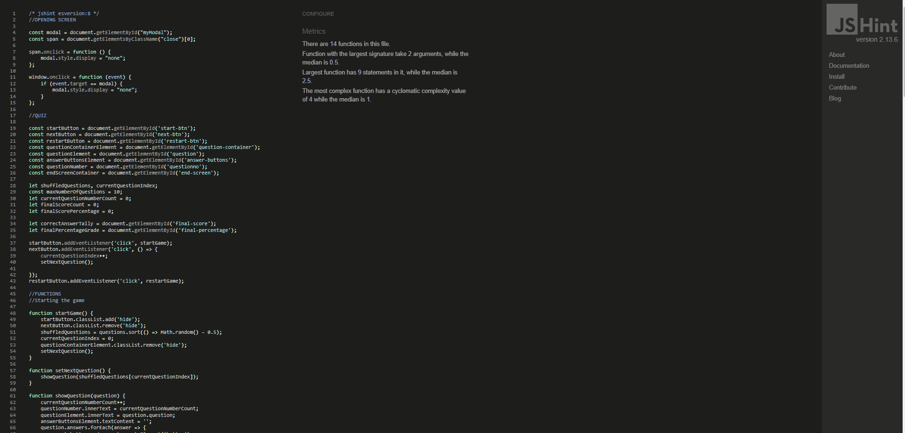

# Testing

- I tested that the website works on Chrome and Microsoft Edge.
- I used devtools to check the responsiveness; I also checked this on the deployed site with my personal desktop computer and mobile phone.

## HTML validator

- HTML was tested using the official [W3C Jigsaw validator](https://validator.w3.org/) and passed:

## CSS validator
- CSS was tested using the official [W3C validator](https://jigsaw.w3.org/css-validator/) and passed:

## JavaScript validator
- JavaScript was tested using the official [JShint validator](https://jshint.com/) and passed:

## Lighthouse
- Lighthouse was used via devtools to analyse the accessibility of the quiz:
- Both mobile and desktop versions received the same score:
 

### Bugs
1. When the quiz restarted, there was a bug causing the question number to continue to climb (e.g. 11/10, 12/10 and so on). I had reset the questionNumber to 0 but needed to set questionNumber.innerText to 0 instead. 
2. Initially, I chose to hide the 'Next' button when the questions were displayed to prevent the user being able to skip questions. This meant that when the next button did appear, that the question would move up on the page creating an uncomfortable user experience. I changed the Next button so that it was 'disabled' instead. 
3. There was a bug where, at the end of question 10, the user was directed straight to the end screen but the quiz screen closed. This meant that the user would not see the answer to question 10. This was fixed by having both the end results screen and the quiz screen opened at the same time so the user could see the answer to question 10 as well as their final results. 